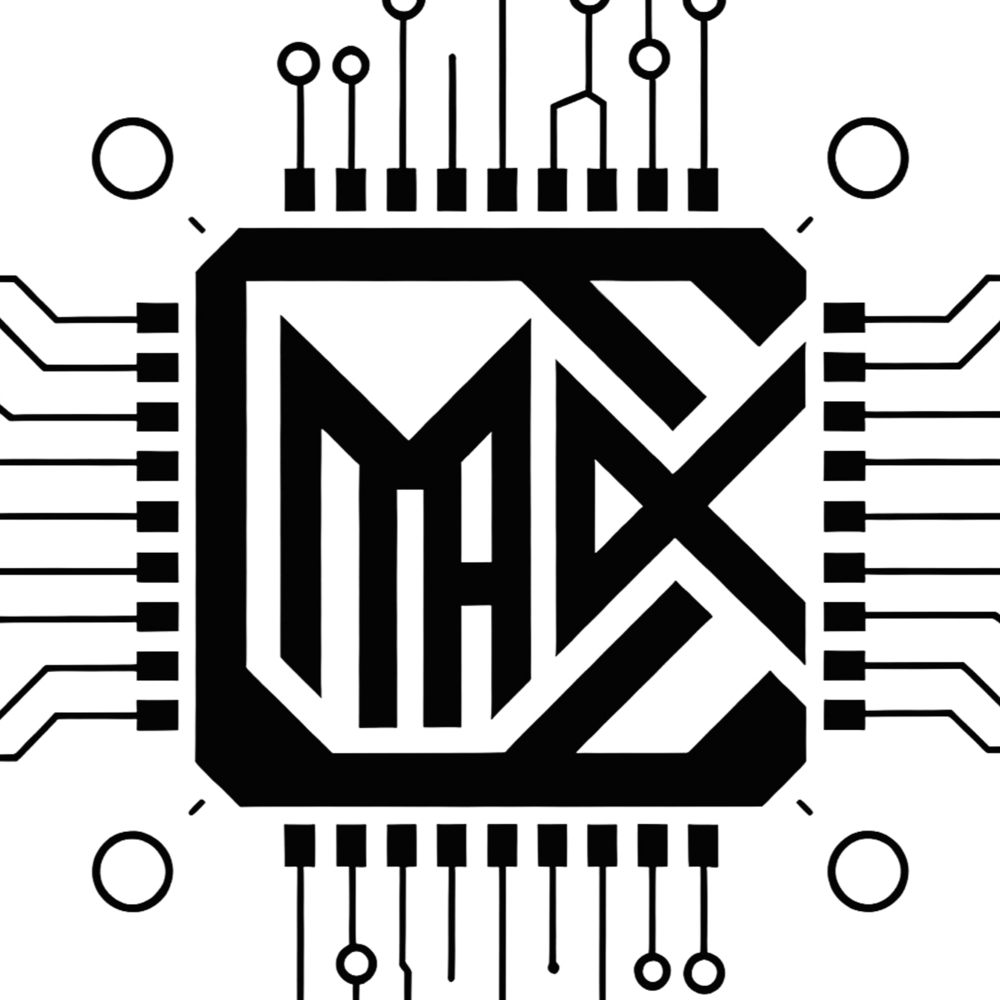

# 嗨！我是 <strong>JularDepick</strong> ! &nbsp;

[**[简体中文]**](README.md)
[**[繁體中文]**](README_zh-TW.md)
[**[English]**](README_en-US.md)
[**[Français]**](README_fr-FR.md)
[**[日本語]**](README_ja-JP.md)
[**[한국어]**](README_ko-KR.md)
[**[Русский]**](README_ru-RU.md)

## 技术栈 🖥️

> 我正在学习的：

> 想要参考我的技术栈学习路线？[点击这里去查看详细信息](TechStack/README.md)

## 我的身份 👻

 📚 一名涉猎<u>多个领域</u>的<strong>爱好者</strong>

<ul>
  <li>👉 啥都想学 👈</li>
  <li>👉 啥都会点 👈</li>
  <li>👉 啥都不精 👈</li>
  <li>👉 🤡我🤡 👈</li>
</ul>

🎓 一名普通的<u>软件工程</u><strong>本科生</strong>

<ul>
  <li>感觉前途一片黑暗 👆</li>
  <li>每天都在逃课睡觉 😴</li>
  <li>偶尔思考职业路线 🤔</li>
  <li>狂想能有大厂捞我 👇</li>
</ul>

👨‍💻 一名起早贪黑<u>打代码</u>的<strong>码农</strong>

<ul>
  <li>老是喜欢手搓造轮子 😄</li>
  <li>在GitHub疯狂造垃圾 💩</li>
  <li>两眼一睁就大战代码 😳</li>
  <li>除了C++啥也学不会 😭</li>
</ul>

🤖 一名鼓捣<u>Agent</u>的<strong>YES工程师</strong>

<ul>
  <li>DeepSeek你怎么这么蠢 🤪</li>
  <li>OpenCode又把UI搞坏了 😰</li>
  <li>Claude又把优化给优化了 😖</li>
  <li>都说了你别碰我的Git啊！ 😡</li>
</ul>

## 我的团队和组织 🏢

&nbsp;&nbsp;<strong>Uxiyu-Team</strong>

一个线下熟人极客小圈子，不过我们暂时没有什么业务。

&nbsp;&nbsp;<strong>Maix-Agent</strong>

我在这里鼓捣人工智能和Agent工具。

## 我的仓库和项目 💩

<strong>Agent Skills</strong>

- [[AGENTS.md-Best-Practices]](https://github.com/JularDepick/AGENTS.md-Best-Practices) 我的Agent使用经验最佳实践
- [[user-thoughts.SKILL]](https://github.com/JularDepick/user-thoughts.SKILL) 让Agent自动组织用户发言，维护持久化、绑定项目的想法文档库
- [[ChatAnalysis.SKILL]](https://github.com/JularDepick/ChatAnalysis.SKILL) 深度分析聊天记录，输出结构化报告，渲染为可浏览的 HTML 页面

<strong>Apps&Games</strong>

- [[Gyroown]](https://github.com/JularDepick/Gyroown) 完全离线的动态加密仓库
- [[Maix-Agent]](https://github.com/JularDepick/Maix-Agent) 一个混合了多种人工智能架构和组件的、具有强大记忆能力的、支持编程化的AI-Agent实现
- [[WhatA-Form]](https://github.com/JularDepick/WhatA-Form) 一个以农场种植为主要玩法的自由世界游戏

<strong>Resources</strong>

- [[Dev-Cpp-5.11-Custom]](https://github.com/JularDepick/Dev-Cpp-5.11-Custom) 携带TDM-GCC-10.3.0编译器的Dev-Cpp-5.11编辑器安装包。提供预设配置安装包和原版安装包

<strong>Website Pages</strong>

- [[JularDepick.github.io]](https://github.com/JularDepick/JularDepick.github.io) 个人GithubPages项目，主要存放文档、演示、教程
- [[Ollama-Web-UI]](https://github.com/JularDepick/Ollama-Web-UI) 基于Vue3的Ollama客户端WebUI，提供浏览器端的对话交互界面
- [[WindsongLyre-Simulator.fork]](https://github.com/JularDepick/WindsongLyre-Simulator.fork) 原神乐器风物之诗琴模拟器
- [[WebMedia-MicroChannel]](https://github.com/JularDepick/WebMedia-MicroChannel) 一个极简、轻量的在线媒体浏览平台，以匿名方式帮你推广喜爱的内容
- [[MicroBlog-GeneralManager]](https://github.com/JularDepick/MicroBlog-GeneralManager) 一款个人微博客管理工具，可实现博客的在线管理以及静态网页的动态生成

<strong>Gadgets</strong>

- [[UAV_MAS]](https://github.com/JularDepick/UAV_MAS) 我高中时为比赛制作的一个与无人机相关的C++程序
- [[LoveHeartCreator]](https://github.com/JularDepick/LoveHeartCreator) 基于笛卡尔心形曲线的变形，在控制台上显示心形图案

## 我偏好的许可证 📄

## 我正在使用的模型和Agent工具 👾

## 赞助我 ❤️

<ul>
<li>

<strong>微信支付(中国大陆)</strong>

</li>
<li><a href="https://paypal.me/JularDepick" target="_blank"><strong>PayPal(海外)</strong></a>
</li>
</ul>

> 我的主页是不是看起来很蠢？哈哈，我是 <s>故意</s> 这样的 🤔
