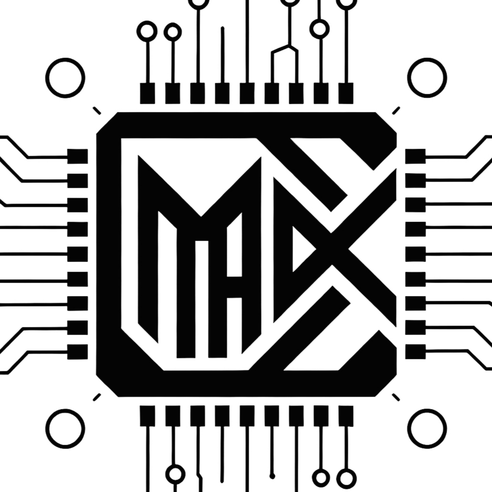

# Привет! Я <strong>JularDepick</strong> ! &nbsp;

[**[简体中文]**](README.md)
[**[繁體中文]**](README_zh-TW.md)
[**[English]**](README_en-US.md)
[**[Français]**](README_fr-FR.md)
[**[日本語]**](README_ja-JP.md)
[**[한국어]**](README_ko-KR.md)
[**[Русский]**](README_ru-RU.md)

 

[**[JularDepick's GitHub Pages]**](https://JularDepick.github.io)

## Технологический стек 🖥️

> Сейчас я изучаю:

> Хотите посмотреть мой план изучения технологий? [Нажмите здесь для подробностей](TechStack/README_ru-RU.md)

## Обо мне 👻

 📚 <strong>Энтузиаст</strong>, интересующийся <u>многими областями</u>

<ul>
  <li>👉 Хочу изучить всё 👈</li>
  <li>👉 Всего понемногу 👈</li>
  <li>👉 Ни в чём не мастер 👈</li>
  <li>👉 🤡Это я🤡 👈</li>
</ul>

🎓 Обычный студент <u>программной инженерии</u>, <strong>бакалавр</strong>

<ul>
  <li>Чувствую, что будущее мрачное 👆</li>
  <li>Каждый день пропускаю пары и сплю 😴</li>
  <li>Иногда задумываюсь о карьере 🤔</li>
  <li>Мечтаю, что большая компания меня заманит 👇</li>
</ul>

👨‍💻 <strong>Кодер</strong>, пишу код от рассвета до заката <u>за клавиатурой</u>

<ul>
  <li>Всё время люблю изобретать велосипед 😄</li>
  <li>Пачками клепаю мусор на GitHub 💩</li>
  <li>Как открою глаза — сразу в бой с кодом 😳</li>
  <li>Кроме C++ ничему научиться не могу 😭</li>
</ul>

🤖 <strong>YES-инженер</strong>, ковыряющийся с <u>Агентами</u>

<ul>
  <li>DeepSeek, ну почему ты такой тупой 🤪</li>
  <li>OpenCode опять сломал интерфейс 😰</li>
  <li>Claude оптимизировал оптимизацию 😖</li>
  <li>Я же говорил — не трогай мой Git! 😡</li>
</ul>

## Мои команды и организации 🏢

&nbsp;&nbsp;<strong>Uxiyu-Team</strong>

Небольшой офлайн-кружок гиков-друзей, пока без какого-либо бизнеса.

&nbsp;&nbsp;<strong>Maix-Agent</strong>

Здесь я ковыряюсь с ИИ и инструментами для Агентов.

## Мои репозитории и проекты 💩

<strong>Agent Skills</strong>

- [[AGENTS.md-Best-Practices]](https://github.com/JularDepick/AGENTS.md-Best-Practices) Мой опыт и лучшие практики использования Агентов
- [[user-thoughts.SKILL]](https://github.com/JularDepick/user-thoughts.SKILL) Автоматическая организация высказываний пользователя и ведение персонализированной, привязанной к проекту библиотеки идей для Агентов
- [[ChatAnalysis.SKILL]](https://github.com/JularDepick/ChatAnalysis.SKILL) Глубокий анализ журналов чатов, вывод структурированных отчётов и рендеринг в просматриваемые HTML-страницы

<strong>Apps&Games</strong>

- [[Gyroown]](https://github.com/JularDepick/Gyroown) Полностью офлайн динамический зашифрованный репозиторий
- [[Maix-Agent]](https://github.com/JularDepick/Maix-Agent) Реализация AI-агента с мощными возможностями памяти и поддержкой программирования, объединяющая множество архитектур и компонентов ИИ
- [[WhatA-Form]](https://github.com/JularDepick/WhatA-Form) Свободный мир с фермерством как основным геймплеем
- [[Graph-Visual]](https://github.com/JularDepick/Graph-Visual) Программа для визуализации графовых структур на C++ Qt6
- [[Crying-Music]](https://github.com/JularDepick/Crying-Music) Реализация музыкального проигрывателя, вдохновлённая популярными проигрывателями

<strong>Resources</strong>

- [[Dev-Cpp-5.11-Custom]](https://github.com/JularDepick/Dev-Cpp-5.11-Custom) Установщик редактора Dev-Cpp-5.11 с компилятором TDM-GCC-10.3.0. Предоставляет установщик с предустановленной конфигурацией и оригинальный установщик.
- [[Virtual-Redstone-Wire]](https://github.com/JularDepick/Virtual-Redstone-Wire) Мод Minecraft для удалённой передачи сигналов редстоуна

<strong>Website Pages</strong>

- [[JularDepick.github.io]](https://github.com/JularDepick/JularDepick.github.io) Личный проект GithubPages, в основном для документации, демо и уроков
- [[Ollama-Web-UI]](https://github.com/JularDepick/Ollama-Web-UI) Клиент Ollama на Vue3 с веб-интерфейсом для чата в браузере
- [[WindsongLyre-Simulator.fork]](https://github.com/JularDepick/WindsongLyre-Simulator.fork) Симулятор музыкального инструмента Песнь Ветра из Genshin Impact
- [[WebMedia-MicroChannel]](https://github.com/JularDepick/WebMedia-MicroChannel) Минималистичная и лёгкая онлайн-платформа для просмотра медиа, анонимно продвигающая любимый контент
- [[MicroBlog-GeneralManager]](https://github.com/JularDepick/MicroBlog-GeneralManager) Инструмент управления личным микроблогом, обеспечивающий онлайн-управление блогом и динамическую генерацию статических веб-страниц

<strong>Gadgets</strong>

- [[UAV_MAS]](https://github.com/JularDepick/UAV_MAS) C++-программа, связанная с БПЛА, которую я сделал для конкурса в старшей школе
- [[LoveHeartCreator]](https://github.com/JularDepick/LoveHeartCreator) Вывод узоров-сердечек на консоли на основе деформации декартовой кривой сердца

## Предпочитаемые лицензии 📄

## Модели и инструменты Агентов, которые я использую 👾

[![CodeX](https://img.shields.io/badge/CodeX-eee?style=flat&logo=data:image/svg+xml;charset=utf-8;base64,PHN2ZyBmaWxsPSJjdXJyZW50Q29sb3IiIGZpbGwtcnVsZT0iZXZlbm9kZCIgaGVpZ2h0PSIxZW0iIHN0eWxlPSJmbGV4Om5vbmU7bGluZS1oZWlnaHQ6MSIgdmlld0JveD0iMCAwIDI0IDI0IiB3aWR0aD0iMWVtIiB4bWxucz0iaHR0cDovL3d3dy53My5vcmcvMjAwMC9zdmciPjx0aXRsZT5Db2RleDwvdGl0bGU+PHBhdGggY2xpcC1ydWxlPSJldmVub2RkIiBkPSJNOC4wODYuNDU3YTYuMTA1IDYuMTA1IDAgMDEzLjA0Ni0uNDE1YzEuMzMzLjE1MyAyLjUyMS43MiAzLjU2NCAxLjdhLjExNy4xMTcgMCAwMC4xMDcuMDI5YzEuNDA4LS4zNDYgMi43NjItLjIyNCA0LjA2MS4zNjZsLjA2My4wMy4xNTQuMDc2YzEuMzU3LjcwMyAyLjMzIDEuNzcgMi45MTggMy4xOTguMjc4LjY3OS40MTggMS4zODguNDIxIDIuMTI2YTUuNjU1IDUuNjU1IDAgMDEtLjE4IDEuNjMxLjE2Ny4xNjcgMCAwMC4wNC4xNTUgNS45ODIgNS45ODIgMCAwMTEuNTc4IDIuODkxYy4zODUgMS45MDEtLjAxIDMuNjE1LTEuMTgzIDUuMTRsLS4xODIuMjJhNi4wNjMgNi4wNjMgMCAwMS0yLjkzNCAxLjg1MS4xNjIuMTYyIDAgMDAtLjEwOC4xMDJjLS4yNTUuNzM2LS41MTEgMS4zNjQtLjk4NyAxLjk5Mi0xLjE5OSAxLjU4Mi0yLjk2MiAyLjQ2Mi00Ljk0OCAyLjQ1MS0xLjU4My0uMDA4LTIuOTg2LS41ODctNC4yMS0xLjczNmEuMTQ1LjE0NSAwIDAwLS4xNC0uMDMyYy0uNTE4LjE2Ny0xLjA0LjE5MS0xLjYwNC4xODVhNS45MjQgNS45MjQgMCAwMS0yLjU5NS0uNjIyIDYuMDU4IDYuMDU4IDAgMDEtMi4xNDYtMS43ODFjLS4yMDMtLjI2OS0uNDA0LS41MjItLjU1MS0uODIxYTcuNzQgNy43NCAwIDAxLS40OTUtMS4yODMgNi4xMSA2LjExIDAgMDEtLjAxNy0zLjA2NC4xNjYuMTY2IDAgMDAuMDA4LS4wNzQuMTE1LjExNSAwIDAwLS4wMzctLjA2NCA1Ljk1OCA1Ljk1OCAwIDAxLTEuMzgtMi4yMDIgNS4xOTYgNS4xOTYgMCAwMS0uMzMzLTEuNTg5IDYuOTE1IDYuOTE1IDAgMDEuMTg4LTIuMTMyYy40NS0xLjQ4NCAxLjMwOS0yLjY0OCAyLjU3Ny0zLjQ5My4yODItLjE4OC41NS0uMzM0LjgwMi0uNDM4LjI4Ni0uMTIuNTczLS4yMi44NjEtLjMwNGEuMTI5LjEyOSAwIDAwLjA4Ny0uMDg3QTYuMDE2IDYuMDE2IDAgMDE1LjYzNSAyLjMxQzYuMzE1IDEuNDY0IDcuMTMyLjg0NiA4LjA4Ni40NTd6bS0uODA0IDcuODVhLjg0OC44NDggMCAwMC0xLjQ3My44NDJsMS42OTQgMi45NjUtMS42ODggMi44NDhhLjg0OS44NDkgMCAwMDEuNDYuODY0bDEuOTQtMy4yNzJhLjg0OS44NDkgMCAwMC4wMDctLjg1NGwtMS45NC0zLjM5M3ptNS40NDYgNi4yNGEuODQ5Ljg0OSAwIDAwMCAxLjY5NWg0Ljg0OGEuODQ5Ljg0OSAwIDAwMC0xLjY5NmgtNC44NDh6Ij48L3BhdGg+PC9zdmc+&logoColor=white)](https://github.com/openai/codex)

## Поддержать меня ❤️

<ul>
<li>

<strong>WeChat Pay / Alipay (материковый Китай)</strong>

</li>
<li><a href="https://paypal.me/JularDepick" target="_blank"><strong>PayPal (за рубежом)</strong></a>
</li>
<li><a href="https://opencollective.com/julardepick" target="_blank"><strong>OpenCollective</strong></a>
</li>
</ul>

> Моя домашняя страница выглядит глупо? Ха-ха, я так <s>специально</s> 🤔

## Заметки

### Прямая raw-ссылка на файл репозитория GitHub

`https://raw.githubusercontent.com/JularDepick/<Repo>/main/<path>`

### GitHub API

- Информация о пользователе `https://api.github.com/users/JularDepick`
- Репозитории пользователя `https://api.github.com/users/JularDepick/repos`

### Бейджи

- Просмотры `&left_text=Просмотры"/>`
- Размер кода `?label=Размер кода"/>`
- Размер репозитория `?label=Размер репозитория"/>`
- Версия релиза `?label=Версия релиза"/>`